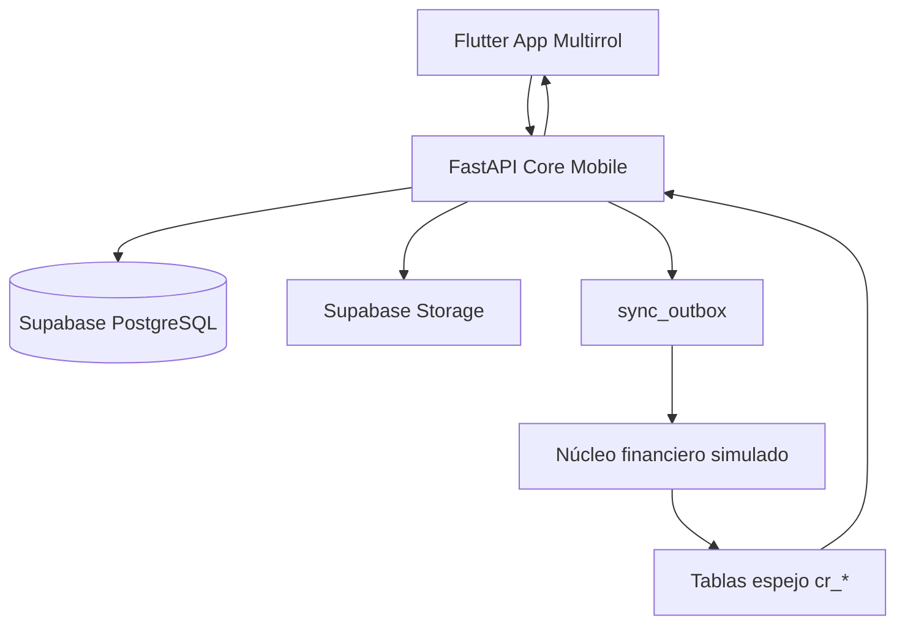
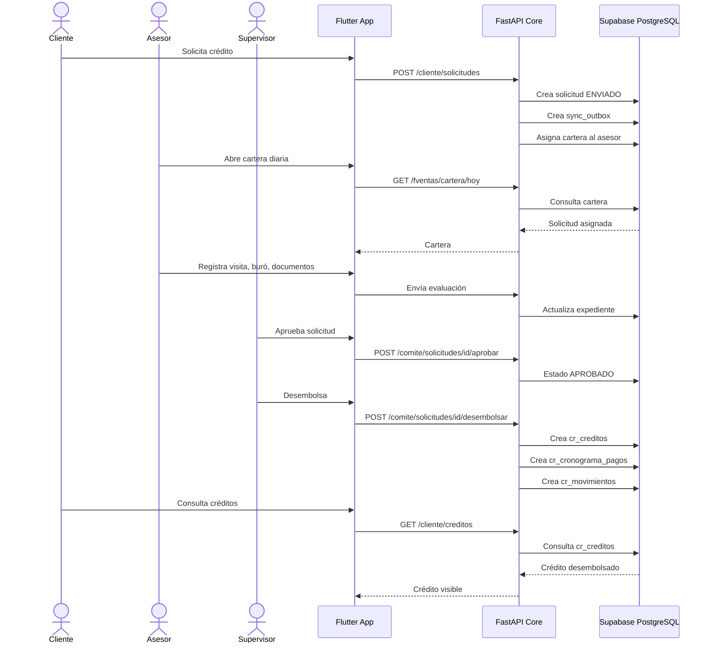

# SIP Mobile Core 360 — Ecosistema Móvil Bancario Integrado

> Proyecto académico inspirado en un ecosistema bancario móvil para SIP.
> Este proyecto no es oficial de SIP ni utiliza servicios reales de la entidad. Es una simulación académica end-to-end para demostrar arquitectura móvil, backend, base de datos, autenticación, roles, originación de créditos y homebanking móvil.

---

## 1. Descripción general del proyecto

El proyecto consiste en desarrollar un **ecosistema móvil bancario integrado** compuesto por:

1. **Una sola aplicación móvil Flutter multirrol**

   * Modo Cliente / Homebanking móvil.
   * Modo Fuerza de Ventas / Asesor de negocios.
   * Modo Supervisor / Administrador.

2. **Un Core Mobile desarrollado en FastAPI**

   * Expone servicios REST.
   * Centraliza la lógica bancaria.
   * Gestiona autenticación JWT y roles.
   * Evalúa solicitudes de crédito.
   * Genera cronogramas de pago.
   * Registra desembolsos.
   * Sincroniza información con el núcleo financiero simulado.

3. **Base de datos Supabase PostgreSQL**

   * Supabase será usado como motor PostgreSQL.
   * La app Flutter NO debe conectarse directamente a tablas sensibles.
   * Todas las operaciones bancarias deben pasar por FastAPI.
   * Supabase almacenará las tablas transaccionales, tablas espejo, logs, documentos y datos demo.

El objetivo es que todo funcione como **un solo sistema end-to-end**, donde un cliente pueda registrar una solicitud de crédito desde la app, el asesor pueda verla en su cartera, evaluarla en campo, enviarla a comité, aprobarla/desembolsarla y luego el cliente pueda visualizar su crédito, cronograma, movimientos y saldo desde la misma app móvil.

---

## 2. Regla principal del proyecto

Este proyecto debe construirse como:

```text
Flutter App Multirrol
        ↓ HTTPS / REST / JWT
FastAPI Core Mobile
        ↓ SQLAlchemy / Supabase PostgreSQL
Supabase PostgreSQL
```

No crear sistemas aislados.

No crear bases de datos separadas.

No crear una app que solo tenga pantallas simuladas.

No usar datos quemados en Flutter para operaciones principales.

No hacer que Flutter escriba directamente créditos, desembolsos, saldos o movimientos bancarios en Supabase.

La app móvil debe consumir endpoints reales de FastAPI.

FastAPI debe ser el único responsable de:

* Login.
* Permisos.
* Evaluación crediticia.
* Comité.
* Desembolso.
* Cronograma.
* Movimientos.
* Sincronización.
* Validación de propietario de datos.

---

## 3. Nombre del proyecto

Nombre sugerido del repositorio:

```text
sip-mobile-core-360
```

Nombre visible en la app:

```text
SIP Mobile Core 360
```

Módulos internos:

```text
Cliente SIP
Fuerza de Ventas SIP
Supervisor SIP
Administrador SIP
```

---

## 4. Tecnologías obligatorias

### Frontend móvil

```text
Flutter
Dart
Riverpod
GoRouter
Dio
flutter_secure_storage
sqflite
connectivity_plus
geolocator
image_picker
signature
intl
fl_chart
```

### Backend

```text
Python
FastAPI
Uvicorn
SQLAlchemy
Pydantic
python-jose
passlib[bcrypt]
python-multipart
psycopg2-binary o asyncpg
python-dotenv
```

### Base de datos

```text
Supabase PostgreSQL
Supabase Storage
SQL DDL versionado
SQL seed versionado
```

---

## 5. Estructura obligatoria del proyecto

Crear esta estructura desde cero:

```text
sip-mobile-core-360/
│
├── README.md
│
├── backend_core_mobile/
│   ├── app/
│   │   ├── main.py
│   │   │
│   │   ├── core/
│   │   │   ├── config.py
│   │   │   ├── security.py
│   │   │   ├── dependencies.py
│   │   │   └── exceptions.py
│   │   │
│   │   ├── database/
│   │   │   ├── connection.py
│   │   │   └── session.py
│   │   │
│   │   ├── models/
│   │   │   ├── usuario_model.py
│   │   │   ├── cliente_model.py
│   │   │   ├── asesor_model.py
│   │   │   ├── cuenta_model.py
│   │   │   ├── credito_model.py
│   │   │   ├── solicitud_model.py
│   │   │   ├── cronograma_model.py
│   │   │   ├── movimiento_model.py
│   │   │   ├── cartera_model.py
│   │   │   ├── visita_model.py
│   │   │   ├── documento_model.py
│   │   │   ├── notificacion_model.py
│   │   │   ├── sync_model.py
│   │   │   └── auditoria_model.py
│   │   │
│   │   ├── schemas/
│   │   │   ├── auth_schema.py
│   │   │   ├── cliente_schema.py
│   │   │   ├── asesor_schema.py
│   │   │   ├── cuenta_schema.py
│   │   │   ├── credito_schema.py
│   │   │   ├── solicitud_schema.py
│   │   │   ├── cronograma_schema.py
│   │   │   ├── movimiento_schema.py
│   │   │   ├── cartera_schema.py
│   │   │   ├── visita_schema.py
│   │   │   ├── documento_schema.py
│   │   │   └── sync_schema.py
│   │   │
│   │   ├── repositories/
│   │   │   ├── usuario_repository.py
│   │   │   ├── cliente_repository.py
│   │   │   ├── asesor_repository.py
│   │   │   ├── cuenta_repository.py
│   │   │   ├── credito_repository.py
│   │   │   ├── solicitud_repository.py
│   │   │   ├── cronograma_repository.py
│   │   │   ├── movimiento_repository.py
│   │   │   ├── cartera_repository.py
│   │   │   ├── visita_repository.py
│   │   │   ├── documento_repository.py
│   │   │   └── sync_repository.py
│   │   │
│   │   ├── services/
│   │   │   ├── auth_service.py
│   │   │   ├── cliente_service.py
│   │   │   ├── asesor_service.py
│   │   │   ├── cuenta_service.py
│   │   │   ├── credito_service.py
│   │   │   ├── solicitud_service.py
│   │   │   ├── preevaluacion_service.py
│   │   │   ├── buro_service.py
│   │   │   ├── comite_service.py
│   │   │   ├── desembolso_service.py
│   │   │   ├── cronograma_service.py
│   │   │   ├── movimiento_service.py
│   │   │   ├── cartera_service.py
│   │   │   ├── visita_service.py
│   │   │   ├── documento_service.py
│   │   │   ├── sync_service.py
│   │   │   └── notificacion_service.py
│   │   │
│   │   └── routes/
│   │       ├── auth_routes.py
│   │       ├── cliente_routes.py
│   │       ├── asesor_routes.py
│   │       ├── cuenta_routes.py
│   │       ├── credito_routes.py
│   │       ├── solicitud_routes.py
│   │       ├── cartera_routes.py
│   │       ├── visita_routes.py
│   │       ├── documento_routes.py
│   │       ├── comite_routes.py
│   │       ├── desembolso_routes.py
│   │       ├── operacion_routes.py
│   │       ├── notificacion_routes.py
│   │       ├── sync_routes.py
│   │       └── admin_routes.py
│   │
│   ├── requirements.txt
│   ├── .env.example
│   └── run_dev.sh
│
├── mobile_app_sip/
│   ├── pubspec.yaml
│   ├── assets/
│   │   ├── images/
│   │   ├── icons/
│   │   └── logos/
│   │
│   └── lib/
│       ├── main.dart
│       ├── app.dart
│       │
│       ├── core/
│       │   ├── config/
│       │   │   ├── api_config.dart
│       │   │   └── app_constants.dart
│       │   ├── network/
│       │   │   ├── dio_client.dart
│       │   │   ├── auth_interceptor.dart
│       │   │   └── connectivity_service.dart
│       │   ├── storage/
│       │   │   ├── secure_storage_service.dart
│       │   │   └── local_database.dart
│       │   ├── theme/
│       │   │   ├── app_colors.dart
│       │   │   ├── app_theme.dart
│       │   │   └── app_text_styles.dart
│       │   ├── router/
│       │   │   └── app_router.dart
│       │   └── utils/
│       │       ├── money_formatter.dart
│       │       ├── date_formatter.dart
│       │       └── validators.dart
│       │
│       ├── shared/
│       │   ├── widgets/
│       │   ├── models/
│       │   └── providers/
│       │
│       └── features/
│           ├── auth/
│           │   ├── data/
│           │   ├── domain/
│           │   └── presentation/
│           │
│           ├── dashboard/
│           │   ├── data/
│           │   ├── domain/
│           │   └── presentation/
│           │
│           ├── cliente_homebanking/
│           │   ├── cuentas/
│           │   ├── creditos/
│           │   ├── cronograma/
│           │   ├── movimientos/
│           │   ├── tarjetas/
│           │   ├── transferencias/
│           │   ├── pagos/
│           │   ├── solicitudes/
│           │   ├── notificaciones/
│           │   └── perfil/
│           │
│           ├── fuerza_ventas/
│           │   ├── cartera/
│           │   ├── ruta/
│           │   ├── ficha_cliente/
│           │   ├── preevaluacion/
│           │   ├── buro/
│           │   ├── solicitud_credito/
│           │   ├── documentos/
│           │   ├── visitas/
│           │   ├── transmision/
│           │   ├── recuperacion_mora/
│           │   └── reportes/
│           │
│           ├── supervisor/
│           │   ├── comite/
│           │   ├── aprobaciones/
│           │   ├── desembolsos/
│           │   ├── reasignacion/
│           │   └── monitoreo/
│           │
│           └── admin/
│               ├── usuarios/
│               ├── asesores/
│               ├── clientes/
│               ├── productos/
│               ├── agencias/
│               └── parametros/
│
├── database_supabase/
│   ├── 00_extensions.sql
│   ├── 01_schema_auth_roles.sql
│   ├── 02_schema_clientes_asesores.sql
│   ├── 03_schema_productos_cuentas.sql
│   ├── 04_schema_solicitudes_credito.sql
│   ├── 05_schema_cartera_visitas.sql
│   ├── 06_schema_creditos_cronograma_movimientos.sql
│   ├── 07_schema_sync_outbox_log.sql
│   ├── 08_schema_notificaciones_documentos.sql
│   ├── 09_policies_rls.sql
│   ├── 10_seed_demo.sql
│   └── 11_views_dashboard.sql
│
└── docs/
    ├── arquitectura/
    │   ├── diagrama_componentes.md
    │   ├── diagrama_flujo_end_to_end.md
    │   └── diagrama_base_datos.md
    ├── historias_usuario/
    │   ├── HU_cliente_homebanking.md
    │   ├── HU_fuerza_ventas.md
    │   └── HU_admin_supervisor.md
    ├── requerimientos/
    │   ├── requerimientos_funcionales.md
    │   └── requerimientos_no_funcionales.md
    ├── pruebas/
    │   ├── casos_prueba_end_to_end.md
    │   └── checklist_rubrica.md
    └── evidencias/
```

---

## 6. Arquitectura funcional

```text
┌─────────────────────────────────────────────────────────────┐
│                    Flutter App Multirrol                    │
│                                                             │
│  Cliente/Homebanking   Fuerza de Ventas   Supervisor/Admin  │
│         │                    │                    │          │
└─────────┼────────────────────┼────────────────────┼──────────┘
          │ HTTPS REST + JWT   │ HTTPS REST + JWT   │
          ▼                    ▼                    ▼
┌─────────────────────────────────────────────────────────────┐
│                    FastAPI Core Mobile                      │
│                                                             │
│ Auth │ RBAC │ Solicitudes │ Crédito │ Comité │ Sync │ Admin │
└───────────────────────────┬─────────────────────────────────┘
                            │ SQLAlchemy
                            ▼
┌─────────────────────────────────────────────────────────────┐
│                    Supabase PostgreSQL                      │
│                                                             │
│ usuarios │ clientes │ asesores │ solicitudes │ cr_* │ sync  │
└─────────────────────────────────────────────────────────────┘
```

---

## 7. Roles del sistema

El login debe identificar el rol del usuario y redirigir automáticamente al dashboard correspondiente.

### Roles obligatorios

| Rol        | Descripción                           | Acceso principal                  |
| ---------- | ------------------------------------- | --------------------------------- |
| CLIENTE    | Cliente bancario                      | Homebanking móvil                 |
| ASESOR     | Oficial de crédito / Fuerza de ventas | Cartera, visitas, solicitudes     |
| SUPERVISOR | Supervisor comercial o comité         | Aprobaciones, reportes, monitoreo |
| ADMIN      | Administrador del sistema             | Usuarios, parámetros, productos   |

### Regla de navegación

Después del login:

```text
CLIENTE     → Dashboard Cliente
ASESOR      → Dashboard Fuerza de Ventas
SUPERVISOR  → Dashboard Supervisor
ADMIN       → Dashboard Administrador
```

El menú debe cambiar según el rol.

No mostrar opciones no autorizadas.

No basta con ocultar opciones en Flutter. FastAPI debe bloquear con 401/403 cualquier endpoint no permitido.

---

## 8. Autenticación y seguridad

### Login

Se deben implementar dos tipos de login en una misma pantalla o en tabs:

1. **Cliente**

   * Documento DNI.
   * Clave.
   * Ejemplo: `40118120 / 123456`.

2. **Colaborador**

   * Código de empleado.
   * Clave.
   * Ejemplo: `A001 / 123456`.

### Token

FastAPI debe devolver:

```json
{
  "access_token": "jwt",
  "token_type": "bearer",
  "usuario": {
    "id_usuario": "uuid",
    "rol": "CLIENTE",
    "nombre": "Nombre del usuario",
    "documento": "40118120"
  }
}
```

Flutter debe guardar el token en:

```text
flutter_secure_storage
```

No guardar token en SharedPreferences.

### Bloqueo por intentos

La app debe bloquear el login después de 5 intentos fallidos.

Tiempo de bloqueo:

```text
30 minutos
```

El bloqueo debe persistir aunque se cierre la app.

### Permisos backend

Crear dependencias en FastAPI:

```text
get_current_user()
require_roles(["ADMIN"])
require_roles(["SUPERVISOR", "ADMIN"])
require_roles(["ASESOR"])
require_roles(["CLIENTE"])
```

Regla importante:

Un cliente solo puede consultar sus propios datos.

Un asesor solo puede consultar su cartera asignada.

Supervisor puede consultar su agencia.

Admin puede gestionar todo.

---

## 9. Base de datos Supabase PostgreSQL

Usar UUID como clave primaria en tablas principales.

Habilitar extensión:

```sql
create extension if not exists "pgcrypto";
```

### 9.1 Tablas de seguridad

#### usuarios

```text
id_usuario UUID PK
documento VARCHAR(15) UNIQUE
codigo_empleado VARCHAR(20) UNIQUE NULL
correo VARCHAR(120) UNIQUE NULL
password_hash TEXT
rol VARCHAR(20) CHECK CLIENTE/ASESOR/SUPERVISOR/ADMIN
estado VARCHAR(20) ACTIVO/BLOQUEADO/INACTIVO
intentos_fallidos INTEGER DEFAULT 0
bloqueado_hasta TIMESTAMPTZ NULL
ultimo_login TIMESTAMPTZ NULL
created_at TIMESTAMPTZ
updated_at TIMESTAMPTZ
```

#### agencias

```text
id_agencia UUID PK
codigo VARCHAR(20)
nombre VARCHAR(100)
direccion TEXT
distrito VARCHAR(100)
provincia VARCHAR(100)
departamento VARCHAR(100)
estado VARCHAR(20)
created_at TIMESTAMPTZ
```

---

### 9.2 Tablas de personas

#### clientes

```text
id_cliente UUID PK
id_usuario UUID FK usuarios
id_agencia UUID FK agencias
documento VARCHAR(15) UNIQUE
nombres VARCHAR(100)
apellidos VARCHAR(100)
telefono VARCHAR(20)
correo VARCHAR(120)
direccion TEXT
distrito VARCHAR(100)
provincia VARCHAR(100)
departamento VARCHAR(100)
fecha_nacimiento DATE
estado_civil VARCHAR(30)
ocupacion VARCHAR(100)
tipo_cliente VARCHAR(30)
estado VARCHAR(20)
created_at TIMESTAMPTZ
updated_at TIMESTAMPTZ
```

#### negocios_cliente

```text
id_negocio UUID PK
id_cliente UUID FK clientes
nombre_comercial VARCHAR(150)
giro_negocio VARCHAR(100)
antiguedad_meses INTEGER
ingreso_mensual NUMERIC(12,2)
gasto_mensual NUMERIC(12,2)
direccion_negocio TEXT
lat_negocio NUMERIC(10,7)
lng_negocio NUMERIC(10,7)
estado VARCHAR(20)
created_at TIMESTAMPTZ
updated_at TIMESTAMPTZ
```

#### asesores

```text
id_asesor UUID PK
id_usuario UUID FK usuarios
id_agencia UUID FK agencias
codigo_empleado VARCHAR(20) UNIQUE
nombres VARCHAR(100)
apellidos VARCHAR(100)
telefono VARCHAR(20)
cargo VARCHAR(80)
estado VARCHAR(20)
created_at TIMESTAMPTZ
updated_at TIMESTAMPTZ
```

---

### 9.3 Productos bancarios

#### productos_credito

```text
id_producto_credito UUID PK
codigo VARCHAR(30)
nombre VARCHAR(120)
tipo VARCHAR(50)
tea_con_seguro NUMERIC(5,2)
tea_sin_seguro NUMERIC(5,2)
monto_minimo NUMERIC(12,2)
monto_maximo NUMERIC(12,2)
plazo_minimo INTEGER
plazo_maximo INTEGER
moneda VARCHAR(3)
estado VARCHAR(20)
created_at TIMESTAMPTZ
```

#### cuentas_ahorro

```text
id_cuenta UUID PK
id_cliente UUID FK clientes
numero_cuenta VARCHAR(30) UNIQUE
cci VARCHAR(30) UNIQUE
moneda VARCHAR(3)
saldo_disponible NUMERIC(12,2)
saldo_contable NUMERIC(12,2)
estado VARCHAR(20)
created_at TIMESTAMPTZ
updated_at TIMESTAMPTZ
```

#### tarjetas

```text
id_tarjeta UUID PK
id_cliente UUID FK clientes
numero_enmascarado VARCHAR(30)
tipo_tarjeta VARCHAR(30)
marca VARCHAR(30)
estado VARCHAR(20)
fecha_vencimiento DATE
created_at TIMESTAMPTZ
```

---

### 9.4 Solicitudes de crédito

#### solicitudes_credito

```text
id_solicitud UUID PK
numero_expediente VARCHAR(30) UNIQUE
id_cliente UUID FK clientes
id_negocio UUID FK negocios_cliente
id_asesor UUID FK asesores NULL
id_producto_credito UUID FK productos_credito
canal_origen VARCHAR(30) CLIENTE/ASESOR
monto_solicitado NUMERIC(12,2)
monto_aprobado NUMERIC(12,2) NULL
plazo_meses INTEGER
moneda VARCHAR(3)
tea_referencial NUMERIC(5,2)
con_seguro_desgravamen BOOLEAN
garantia VARCHAR(50)
destino_credito TEXT
cuota_estimada NUMERIC(12,2)
estado VARCHAR(30)
resultado_preevaluacion VARCHAR(30) NULL
puntaje_preevaluacion INTEGER NULL
resultado_buro VARCHAR(30) NULL
motivo_rechazo TEXT NULL
condicion_adicional TEXT NULL
firma_cliente_base64 TEXT NULL
lat_captura NUMERIC(10,7) NULL
lng_captura NUMERIC(10,7) NULL
pendiente_sync BOOLEAN DEFAULT FALSE
created_at TIMESTAMPTZ
updated_at TIMESTAMPTZ
```

Estados permitidos:

```text
BORRADOR
ENVIADO
RECIBIDO_COMITE
EN_EVALUACION
APROBADO
CONDICIONADO
RECHAZADO
DESEMBOLSADO
```

---

### 9.5 Cartera y visitas

#### cartera_diaria

```text
id_cartera UUID PK
id_asesor UUID FK asesores
id_cliente UUID FK clientes
id_solicitud UUID FK solicitudes_credito NULL
fecha_asignacion DATE
tipo_gestion VARCHAR(50)
prioridad VARCHAR(20)
score_prioridad INTEGER
estado_visita VARCHAR(30)
resultado_visita VARCHAR(50) NULL
observacion_visita TEXT NULL
lat_visita NUMERIC(10,7) NULL
lng_visita NUMERIC(10,7) NULL
timestamp_visita TIMESTAMPTZ NULL
pendiente_sync BOOLEAN DEFAULT FALSE
created_at TIMESTAMPTZ
updated_at TIMESTAMPTZ
```

Tipos de gestión:

```text
NUEVA_SOLICITUD
RENOVACION
AMPLIACION
SEGUIMIENTO
RECUPERACION_MORA
DESERTOR
```

#### visitas_cliente

```text
id_visita UUID PK
id_cartera UUID FK cartera_diaria
id_asesor UUID FK asesores
id_cliente UUID FK clientes
resultado VARCHAR(50)
observacion TEXT
lat NUMERIC(10,7)
lng NUMERIC(10,7)
fecha_hora TIMESTAMPTZ
created_at TIMESTAMPTZ
```

---

### 9.6 Buró y preevaluación

#### consultas_buro

```text
id_consulta UUID PK
id_solicitud UUID FK solicitudes_credito
id_cliente UUID FK clientes
documento VARCHAR(15)
calificacion VARCHAR(30)
entidades_deuda INTEGER
deuda_total NUMERIC(12,2)
mayor_mora_dias INTEGER
esta_inhabilitado BOOLEAN
resultado VARCHAR(30)
created_at TIMESTAMPTZ
```

Reglas de buró simulado:

```text
Último dígito 0,1,2,3 → NORMAL
Último dígito 4,5 → CPP
Último dígito 6,7 → DEFICIENTE
Último dígito 8 → DUDOSO
Último dígito 9 → PERDIDA
```

Si está en lista de inhabilitados, la solicitud debe bloquearse y pasar a RECHAZADO.

#### listas_inhabilitados

```text
id_lista UUID PK
documento VARCHAR(15) UNIQUE
motivo TEXT
estado VARCHAR(20)
created_at TIMESTAMPTZ
```

---

### 9.7 Documentos

#### solicitudes_documentos

```text
id_documento UUID PK
id_solicitud UUID FK solicitudes_credito
tipo_documento VARCHAR(50)
nombre_archivo VARCHAR(200)
storage_path TEXT
url_publica TEXT NULL
estado_validacion VARCHAR(30)
created_at TIMESTAMPTZ
```

Tipos de documento:

```text
DNI_FRENTE
DNI_REVERSO
SUSTENTO_NEGOCIO
FOTO_NEGOCIO
FOTO_VISITA
FIRMA_CLIENTE
```

---

### 9.8 Tablas espejo del núcleo financiero

Estas tablas representan lo que ve el cliente luego del desembolso.

#### cr_creditos

```text
id_credito UUID PK
id_solicitud UUID FK solicitudes_credito
id_cliente UUID FK clientes
numero_credito VARCHAR(30) UNIQUE
producto VARCHAR(120)
monto_desembolsado NUMERIC(12,2)
saldo_capital NUMERIC(12,2)
plazo_meses INTEGER
tea NUMERIC(5,2)
tem NUMERIC(8,6)
cuota_mensual NUMERIC(12,2)
fecha_desembolso DATE
dia_pago INTEGER
estado VARCHAR(30)
created_at TIMESTAMPTZ
updated_at TIMESTAMPTZ
```

#### cr_cronograma_pagos

```text
id_cuota UUID PK
id_credito UUID FK cr_creditos
numero_cuota INTEGER
fecha_pago DATE
monto_cuota NUMERIC(12,2)
capital NUMERIC(12,2)
interes NUMERIC(12,2)
saldo NUMERIC(12,2)
estado VARCHAR(30)
fecha_pago_real DATE NULL
monto_pagado NUMERIC(12,2) DEFAULT 0
created_at TIMESTAMPTZ
```

Estados de cuota:

```text
PENDIENTE
PAGADA
VENCIDA
PARCIAL
```

#### cr_movimientos

```text
id_movimiento UUID PK
id_cliente UUID FK clientes
id_cuenta UUID FK cuentas_ahorro NULL
id_credito UUID FK cr_creditos NULL
tipo_movimiento VARCHAR(50)
descripcion TEXT
monto NUMERIC(12,2)
moneda VARCHAR(3)
fecha_movimiento TIMESTAMPTZ
canal VARCHAR(30)
created_at TIMESTAMPTZ
```

Tipos:

```text
DESEMBOLSO_CREDITO
TRANSFERENCIA
PAGO_CUOTA
DEPOSITO
RETIRO
AJUSTE
```

---

### 9.9 Operaciones cliente

#### operaciones_cliente

```text
id_operacion UUID PK
id_cliente UUID FK clientes
tipo_operacion VARCHAR(50)
cuenta_origen UUID FK cuentas_ahorro NULL
cuenta_destino VARCHAR(30) NULL
id_credito UUID FK cr_creditos NULL
monto NUMERIC(12,2)
moneda VARCHAR(3)
descripcion TEXT
estado VARCHAR(30)
created_at TIMESTAMPTZ
updated_at TIMESTAMPTZ
```

Tipos:

```text
TRANSFERENCIA
PAGO_CREDITO
PAGO_SERVICIO
```

Estados:

```text
PENDIENTE
PROCESADA
RECHAZADA
```

---

### 9.10 Notificaciones

#### notificaciones

```text
id_notificacion UUID PK
id_usuario UUID FK usuarios
titulo VARCHAR(150)
mensaje TEXT
tipo VARCHAR(50)
leida BOOLEAN DEFAULT FALSE
created_at TIMESTAMPTZ
```

---

### 9.11 Sincronización

#### sync_outbox

```text
id_evento UUID PK
tipo_evento VARCHAR(80)
entidad VARCHAR(80)
entidad_id UUID
payload JSONB
estado VARCHAR(30)
intentos INTEGER DEFAULT 0
error TEXT NULL
created_at TIMESTAMPTZ
procesado_at TIMESTAMPTZ NULL
```

Estados:

```text
PENDIENTE
PROCESADO
ERROR
```

#### sync_log

```text
id_log UUID PK
id_evento UUID FK sync_outbox NULL
accion VARCHAR(100)
resultado VARCHAR(30)
detalle TEXT
created_at TIMESTAMPTZ
```

---

### 9.12 Auditoría

#### auditoria_eventos

```text
id_auditoria UUID PK
id_usuario UUID FK usuarios
accion VARCHAR(100)
entidad VARCHAR(100)
entidad_id UUID NULL
ip VARCHAR(80)
user_agent TEXT
detalle JSONB
created_at TIMESTAMPTZ
```

---

## 10. Flujo end-to-end obligatorio

El sistema debe cumplir este flujo completo:

```text
1. Cliente inicia sesión con DNI y clave.
2. Cliente registra solicitud de crédito.
3. FastAPI crea solicitud en estado ENVIADO.
4. FastAPI crea evento en sync_outbox.
5. FastAPI asigna la solicitud a un asesor.
6. Asesor inicia sesión con código de empleado.
7. Asesor ve la solicitud en su cartera diaria.
8. Asesor abre ficha del cliente.
9. Asesor registra visita con GPS.
10. Asesor ejecuta preevaluación.
11. Asesor consulta buró simulado.
12. Asesor adjunta documentos y firma.
13. Asesor envía expediente al comité.
14. Supervisor/Admin revisa expediente.
15. Comité aprueba, condiciona o rechaza.
16. Si aprueba, se desembolsa.
17. FastAPI crea cr_creditos.
18. FastAPI genera cr_cronograma_pagos.
19. FastAPI registra cr_movimientos.
20. Cliente entra a su homebanking y ve el crédito.
```

---

## 11. Fórmula financiera obligatoria

Para créditos con cuota fija se debe usar amortización francesa.

### Tasa efectiva mensual

```text
TEM = (1 + TEA)^(1/12) - 1
```

### Cuota mensual

```text
cuota = monto * TEM / (1 - (1 + TEM)^(-plazo_meses))
```

### Cronograma

Por cada cuota:

```text
interes = saldo_actual * TEM
capital = cuota - interes
saldo = saldo_actual - capital
```

La última cuota debe ajustar el saldo a cero para evitar diferencias por redondeo.

---

## 12. Endpoints obligatorios FastAPI

### Auth

```text
POST /auth/login
POST /auth/logout
GET  /auth/me
```

### Cliente / Homebanking

```text
GET  /cliente/perfil
GET  /cliente/cuentas
GET  /cliente/movimientos
GET  /cliente/tarjetas
GET  /cliente/creditos
GET  /cliente/creditos/{id_credito}
GET  /cliente/creditos/{id_credito}/cronograma
GET  /cliente/notificaciones
POST /cliente/solicitudes
GET  /cliente/solicitudes
GET  /cliente/solicitudes/{id_solicitud}
POST /cliente/operaciones/transferencia
POST /cliente/operaciones/pago-credito
```

### Fuerza de Ventas

```text
GET  /fventas/cartera/hoy
GET  /fventas/cartera/{id_cartera}
GET  /fventas/clientes/{id_cliente}/ficha
POST /fventas/visitas
POST /fventas/solicitudes
PUT  /fventas/solicitudes/{id_solicitud}
POST /fventas/solicitudes/{id_solicitud}/preevaluar
POST /fventas/solicitudes/{id_solicitud}/buro
POST /fventas/solicitudes/{id_solicitud}/documentos
POST /fventas/solicitudes/{id_solicitud}/firma
POST /fventas/solicitudes/{id_solicitud}/enviar-comite
GET  /fventas/solicitudes
GET  /fventas/solicitudes/{id_solicitud}
```

### Supervisor / Comité

```text
GET  /comite/solicitudes
GET  /comite/solicitudes/{id_solicitud}
POST /comite/solicitudes/{id_solicitud}/recibir
POST /comite/solicitudes/{id_solicitud}/evaluar
POST /comite/solicitudes/{id_solicitud}/aprobar
POST /comite/solicitudes/{id_solicitud}/condicionar
POST /comite/solicitudes/{id_solicitud}/rechazar
POST /comite/solicitudes/{id_solicitud}/desembolsar
```

### Admin

```text
GET    /admin/usuarios
POST   /admin/usuarios
PUT    /admin/usuarios/{id_usuario}
DELETE /admin/usuarios/{id_usuario}

GET    /admin/clientes
GET    /admin/asesores
GET    /admin/productos-creditos
POST   /admin/productos-creditos
PUT    /admin/productos-creditos/{id_producto}
```

### Sync

```text
GET  /sync/outbox
POST /sync/procesar
GET  /sync/log
```

### Health

```text
GET /health
```

---

## 13. Reglas de negocio principales

### Solicitud de crédito

Una solicitud puede nacer desde:

```text
CLIENTE
ASESOR
```

Si nace desde cliente:

```text
canal_origen = CLIENTE
estado = ENVIADO
```

Debe aparecer automáticamente en la cartera del asesor como:

```text
tipo_gestion = NUEVA_SOLICITUD
```

### Preevaluación

Calcular capacidad de pago:

```text
capacidad_pago = ingreso_mensual - gasto_mensual
ratio_cuota = cuota_estimada / capacidad_pago
```

Reglas sugeridas:

```text
ratio_cuota <= 0.40        → APTO, puntaje 85
ratio_cuota > 0.40 <= 0.60 → REVISAR, puntaje 60
ratio_cuota > 0.60         → NO_APTO, puntaje 30
```

### Buró

La consulta de buró debe ser determinística según documento.

Si el cliente está en lista de inhabilitados:

```text
resultado_buro = PERDIDA
estado_solicitud = RECHAZADO
motivo_rechazo = Cliente registrado en lista de inhabilitados
```

### Comité

Solo SUPERVISOR o ADMIN pueden aprobar, condicionar, rechazar o desembolsar.

### Desembolso

Al desembolsar:

1. Cambiar solicitud a DESEMBOLSADO.
2. Crear `cr_creditos`.
3. Crear `cr_cronograma_pagos`.
4. Crear movimiento `DESEMBOLSO_CREDITO`.
5. Crear notificación al cliente.
6. Registrar evento en `sync_log`.

---

## 14. App Flutter multirrol

La app debe ser una sola, pero organizada por módulos.

### Pantallas públicas

```text
SplashScreen
LoginScreen
ForgotPasswordScreen
```

### Dashboard Cliente

```text
ClienteDashboardScreen
PerfilClienteScreen
CuentasScreen
CuentaDetalleScreen
MovimientosScreen
CreditosScreen
CreditoDetalleScreen
CronogramaScreen
TarjetasScreen
SolicitarCreditoScreen
TransferenciaScreen
PagoCreditoScreen
NotificacionesScreen
```

### Dashboard Asesor / Fuerza de Ventas

```text
AsesorDashboardScreen
CarteraHoyScreen
CarteraDetalleScreen
RutaScreen
FichaClienteScreen
PreevaluacionScreen
BuroScreen
SolicitudCreditoStepperScreen
DocumentosSolicitudScreen
FirmaClienteScreen
TransmisionExpedienteScreen
EstadoSolicitudesScreen
RecuperacionMoraScreen
ReportesAsesorScreen
```

### Dashboard Supervisor

```text
SupervisorDashboardScreen
ComiteSolicitudesScreen
SolicitudComiteDetalleScreen
AprobarSolicitudScreen
DesembolsoScreen
MonitorAsesoresScreen
ReportesSupervisorScreen
```

### Dashboard Admin

```text
AdminDashboardScreen
UsuariosScreen
ClientesAdminScreen
AsesoresAdminScreen
ProductosCreditoScreen
ParametrosScreen
SyncLogScreen
```

---

## 15. Arquitectura Flutter obligatoria

Usar arquitectura por feature:

```text
feature/
├── data/
│   ├── datasources/
│   ├── models/
│   └── repositories_impl/
├── domain/
│   ├── entities/
│   ├── repositories/
│   └── usecases/
└── presentation/
    ├── providers/
    ├── screens/
    └── widgets/
```

No poner lógica de negocio en los widgets.

Los widgets solo deben mostrar UI y llamar providers.

Los cálculos deben estar en servicios, usecases o ViewModels.

---

## 16. Offline-first

### Para Fuerza de Ventas

Debe funcionar offline para:

```text
Cartera diaria
Ficha cliente
Visitas
Borradores de solicitud
Documentos pendientes
Firma pendiente
Transmisión pendiente
```

Usar SQLite local.

Tablas locales mínimas:

```text
local_cartera
local_clientes
local_solicitudes_pendientes
local_visitas_pendientes
local_documentos_pendientes
local_sync_queue
```

Regla:

```text
Si hay internet:
    consumir FastAPI
    guardar copia local
Si no hay internet:
    leer SQLite
    permitir edición local cuando aplique
    marcar pendiente_sync = true
Cuando vuelva internet:
    sincronizar pendientes
```

### Para Cliente / Homebanking

Puede cachear consultas:

```text
perfil
cuentas
créditos
cronograma
movimientos
notificaciones
```

Pero operaciones sensibles como transferencia o pago de crédito deben requerir conexión.

Si no hay internet:

```text
Mostrar mensaje: "Operación no disponible sin conexión"
```

---

## 17. Diseño visual

Usar branding referencial SIP:

```text
Color principal: #002A8D
Color acento: #FF7800
Blanco: #FFFFFF
Gris fondo: #F5F6FA
Gris texto: #4A4A4A
Error: #D32F2F
Éxito: #2E7D32
Advertencia: #F9A825
```

### Estilo

```text
Diseño moderno
Cards con bordes redondeados
Tipografía clara
Botones grandes
Menú inferior para cliente
Menú lateral o drawer para asesor/admin
Iconografía bancaria
Estados con colores
No usar pantallas vacías
No usar textos genéricos como "Página en construcción"
```

---

## 18. Datos demo obligatorios

Crear seed con:

```text
1 admin
1 supervisor
3 asesores
30 clientes
30 negocios
30 solicitudes de crédito
cuentas de ahorro
tarjetas
créditos desembolsados
cronogramas
movimientos
notificaciones
cartera diaria
lista de inhabilitados
productos de crédito
```

Usuarios sugeridos:

```text
ADMIN:
usuario: ADM001
clave: 123456

SUPERVISOR:
usuario: SUP001
clave: 123456

ASESOR:
usuario: A001
clave: 123456

CLIENTE:
usuario: 40118120
clave: 123456
```

---

## 19. Variables de entorno backend

Crear archivo:

```text
backend_core_mobile/.env.example
```

Contenido:

```env
APP_NAME=SIP Mobile Core 360
APP_ENV=development
APP_DEBUG=true

DATABASE_URL=postgresql://postgres:[PASSWORD]@[HOST]:5432/postgres

JWT_SECRET_KEY=change_this_secret_key
JWT_ALGORITHM=HS256
JWT_EXPIRE_MINUTES=480

CORS_ORIGINS=*

SUPABASE_URL=https://your-project.supabase.co
SUPABASE_SERVICE_ROLE_KEY=your-service-role-key
SUPABASE_STORAGE_BUCKET=documentos-creditos

DEFAULT_ADMIN_PASSWORD=123456
```

No subir `.env` real al repositorio.

No poner claves reales en código.

---

## 20. Configuración Flutter

Crear:

```text
mobile_app_sip/lib/core/config/api_config.dart
```

Debe permitir cambiar URL según entorno:

```text
Android emulator: http://10.0.2.2:8003
iOS simulator: http://127.0.0.1:8003
Dispositivo físico: http://IP_LOCAL:8003
Producción: URL desplegada
```

No hardcodear URLs en cada pantalla.

Toda llamada API debe pasar por `DioClient`.

---

## 21. Comandos de ejecución

### Backend

```bash
cd backend_core_mobile

python -m venv venv

# Windows
venv\Scripts\activate

# Linux / Mac
source venv/bin/activate

pip install -r requirements.txt

uvicorn app.main:app --reload --host 0.0.0.0 --port 8003
```

Swagger:

```text
http://localhost:8003/docs
```

Health check:

```text
http://localhost:8003/health
```

### Flutter

```bash
cd mobile_app_sip
flutter pub get
flutter run
```

### Supabase

Ejecutar los SQL en orden:

```text
00_extensions.sql
01_schema_auth_roles.sql
02_schema_clientes_asesores.sql
03_schema_productos_cuentas.sql
04_schema_solicitudes_credito.sql
05_schema_cartera_visitas.sql
06_schema_creditos_cronograma_movimientos.sql
07_schema_sync_outbox_log.sql
08_schema_notificaciones_documentos.sql
09_policies_rls.sql
10_seed_demo.sql
11_views_dashboard.sql
```

---

## 22. Criterios de aceptación técnicos

El proyecto se considera completo si cumple:

### Integración end-to-end

```text
Cliente crea solicitud
Solicitud llega al Core
Solicitud aparece en cartera del asesor
Asesor evalúa
Comité aprueba
Desembolso genera crédito
Cliente visualiza crédito y cronograma
```

### App Cliente

```text
Login con DNI
Perfil
Cuentas
Saldos
Movimientos
Créditos
Cronograma
Tarjetas
Notificaciones
Solicitar crédito
Pago de crédito
Transferencia
```

### Fuerza de Ventas

```text
Login con código de empleado
Cartera diaria
Filtros
Prioridades
Ficha cliente
Visita con GPS
Preevaluación
Buró simulado
Documentos
Firma
Envío a comité
Estado de solicitudes
```

### Supervisor/Admin

```text
Ver solicitudes en comité
Aprobar
Condicionar
Rechazar
Desembolsar
Ver reportes
Gestionar usuarios
Gestionar productos
Ver sync log
```

### Seguridad

```text
JWT
flutter_secure_storage
Roles
401/403 backend
Bloqueo por intentos
Logout seguro
Auditoría
```

### Base de datos

```text
Integridad referencial
Tablas cr_*
sync_outbox
sync_log
Seeds demo
DDL versionado
```

---

## 23. Prohibiciones para Antigravity

No hacer esto:

```text
No crear dos apps Flutter separadas.
No crear solo frontend sin backend.
No usar datos mock en pantallas principales.
No conectar Flutter directamente a Supabase para créditos o saldos.
No guardar JWT en SharedPreferences.
No dejar endpoints sin protección.
No validar roles solo en Flutter.
No crear tablas con nombres diferentes a los definidos sin motivo.
No eliminar sync_outbox ni sync_log.
No eliminar tablas cr_*.
No cambiar el flujo de estados del expediente.
No crear un sistema sin desembolso real.
No crear cronograma solo visual sin persistirlo.
No dejar URLs hardcodeadas por pantalla.
No subir claves reales.
No mezclar lógica de negocio dentro de widgets Flutter.
No dejar carpetas vacías.
```

---

## 24. Prioridad de desarrollo

Desarrollar en este orden:

### Fase 1 — Base

```text
Crear Supabase schema
Crear seeds
Crear backend FastAPI
Crear auth JWT
Crear roles
Crear health check
```

### Fase 2 — Cliente

```text
Login cliente
Dashboard cliente
Perfil
Cuentas
Movimientos
Créditos
Cronograma
Solicitar crédito
```

### Fase 3 — Fuerza de Ventas

```text
Login asesor
Cartera diaria
Ficha cliente
Visita GPS
Preevaluación
Buró
Solicitud stepper
Documentos
Firma
Envío comité
```

### Fase 4 — Comité y desembolso

```text
Dashboard supervisor
Bandeja comité
Aprobar
Rechazar
Condicionar
Desembolsar
Generar cr_creditos
Generar cronograma
Generar movimientos
Notificar cliente
```

### Fase 5 — Offline y sincronización

```text
SQLite
Cache cartera
Cola offline
sync_outbox
sync_log
Reconexión automática
```

### Fase 6 — Calidad final

```text
Validar flujo end-to-end
Validar roles
Validar 401/403
Validar datos demo
Validar diseño SIP
Documentar Swagger
Documentar README
Agregar diagramas
```

---

## 25. Flujo mínimo que debe funcionar para la entrega

El flujo mínimo demostrable debe ser:

```text
1. Login como cliente 40118120.
2. Cliente crea solicitud de crédito de S/ 1,000 a 12 meses.
3. Sistema genera número de expediente.
4. Login como asesor A001.
5. Asesor ve esa solicitud en cartera.
6. Asesor registra visita con GPS.
7. Asesor ejecuta preevaluación.
8. Asesor consulta buró.
9. Asesor adjunta documentos y firma.
10. Asesor envía a comité.
11. Login como supervisor SUP001.
12. Supervisor aprueba.
13. Supervisor desembolsa.
14. Sistema genera crédito y cronograma.
15. Login nuevamente como cliente.
16. Cliente ve crédito desembolsado.
17. Cliente ve cronograma de pagos.
18. Cliente ve movimiento de desembolso.
```

---

## 26. Documentación requerida

Crear dentro de `docs/`:

```text
diagrama_componentes.md
diagrama_flujo_end_to_end.md
diagrama_base_datos.md
historias_usuario_cliente.md
historias_usuario_fuerza_ventas.md
historias_usuario_admin.md
requerimientos_funcionales.md
requerimientos_no_funcionales.md
casos_prueba_end_to_end.md
checklist_rubrica.md
```

---

## 27. Diagrama de componentes sugerido



---

## 28. Diagrama del flujo de crédito



---

## 29. Resultado esperado

Al finalizar, el proyecto debe demostrar:

```text
Una sola app Flutter multirrol
Un backend FastAPI completo
Una base Supabase PostgreSQL compartida
Flujo end-to-end real
Roles y permisos
Originación de crédito
Evaluación en campo
Buró simulado
Comité
Desembolso
Cronograma
Homebanking cliente
Offline-first para fuerza de ventas
Documentación técnica
Scripts SQL versionados
```

---

## 30. Indicaciones finales para Antigravity

Construir el proyecto desde cero respetando esta arquitectura.

Priorizar funcionalidad real sobre pantallas decorativas.

Todo endpoint debe tener:

* Router.
* Schema.
* Service.
* Repository.
* Validación de rol.
* Manejo de errores.

Toda pantalla Flutter debe tener:

* UI clara.
* Provider/ViewModel.
* Repository.
* Modelo.
* Consumo real de API.
* Manejo de loading, error y empty state.

El sistema debe poder ejecutarse localmente y conectarse a Supabase.

No finalizar hasta que el flujo mínimo end-to-end funcione completo.
