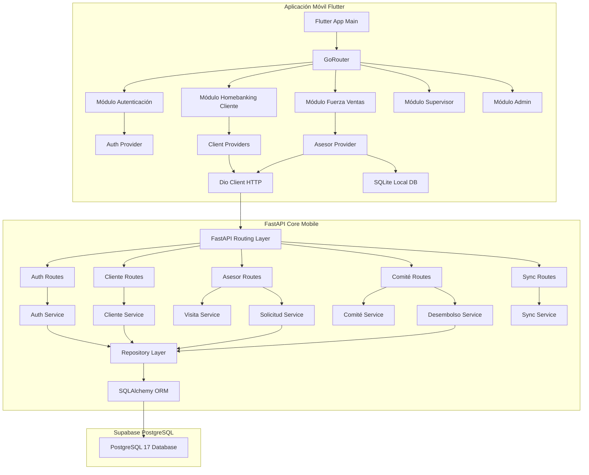

# Diagrama de Componentes — SIP Mobile Core 360

Este documento ilustra la arquitectura de componentes y la separación de responsabilidades del ecosistema **SIP Mobile Core 360**.

## Arquitectura General

El ecosistema sigue un modelo desacoplado mediante una API REST en FastAPI que actúa como el único intermediario seguro entre la aplicación cliente en Flutter y la base de datos PostgreSQL.

## Descripción de Componentes

### 1. Frontend (Flutter)
- **Dio Client & Interceptor:** Administra las cabeceras HTTP de forma centralizada y asocia automáticamente el token JWT obtenido del almacenamiento seguro.
- **SQLite Local (sqflite):** Almacena y cachea localmente la cartera diaria, datos de fichas de clientes y encola las transacciones y visitas capturadas cuando no hay señal de red.
- **Riverpod State Notifiers:** Maneja el estado lógico de los formularios, flujos de Stepper de solicitud, cronogramas y pagos del homebanking.

### 2. Backend (FastAPI)
- **Routing Layer:** Define y expone los endpoints REST API organizados por etiquetas funcionales. Aplica las dependencias de control de roles (RBAC) inyectando excepciones HTTP 401/403 si un rol no está autorizado.
- **Business Service Layer:** Contiene algoritmos puros como la amortización francesa, las reglas de capacidad de pago del preevaluador, la resolución de calificaciones del buró de crédito simulado y la lógica de desembolso crediticio.
- **Repository Layer (Patrón Repository):** Aísla por completo las consultas SQL y transacciones SQLAlchemy.

### 3. Base de Datos (PostgreSQL)
- Estructura relacional robusta con 17 tablas estructuradas de forma consistente y triggers que registran eventos transaccionales automáticos.
